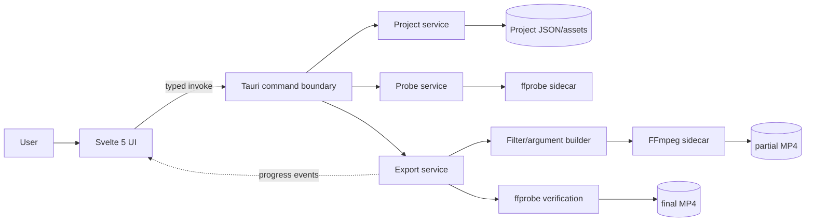

# Skull’d Clip Forge — Master Software Specification

## 1. Executive summary

Skull’d Clip Forge is a local-first desktop application that converts a raw gameplay clip into a branded vertical MP4 through a deliberately narrow workflow:

1. Import a local clip.
2. Select an in/out range.
3. Position a locked 9:16 crop.
4. Add a hook caption, optional image branding, and an optional Skull’d sting.
5. Export a verified 1080×1920 MP4.

The application uses a Svelte 5 frontend inside Tauri 2. Rust owns project persistence, path authorization, ffprobe, FFmpeg execution, progress, cancellation and output verification. User media never needs to leave the device.

The target is a reliable MVP in roughly **30–36 focused engineering hours**, excluding public code signing, store submission and commercial FFmpeg licensing review.

## 2. Goals

### Primary

Reduce the raw-clip-to-publishable-file workflow to five primary actions without opening a full non-linear editor.

### Secondary

- Learn Tauri 2 and practical Rust process boundaries.
- Learn Svelte 5 runes in a production-shaped project.
- Produce a tool that remains useful for the Skull’d gaming channel.
- Preserve an upgrade path for templates, mascot events and local transcription.

## 3. Non-goals

The MVP will not include:

- user accounts;
- cloud storage or sync;
- analytics;
- direct YouTube/TikTok/Instagram publishing;
- AI-generated captions;
- speech-to-text;
- multiple source clips;
- transitions;
- general-purpose audio mixing;
- waveform editing;
- arbitrary animated overlays or multiple video tracks;
- mobile apps;
- a plugin ecosystem;
- arbitrary shell execution from JavaScript.

## 4. Target platforms

1. **P0:** Windows 11 x64.
2. **P1:** macOS 13+ on Apple Silicon and Intel.
3. **Deferred:** Linux.

The architecture remains cross-platform, but Windows is the first release gate.

## 5. Technology choices

| Layer | Choice | Rationale |
|---|---|---|
| Desktop shell | Tauri 2 | Native capabilities behind a constrained Rust boundary |
| UI | Svelte 5 + TypeScript | Fast visual iteration and a genuinely different reactive model |
| Native core | Rust | Path safety, process lifecycle and typed domain validation |
| Media | FFmpeg + ffprobe | Mature probing, filtering, encoding and muxing |
| Project persistence | Versioned JSON folders | Human-readable, portable, no database overhead |
| App preferences | Tauri Store plugin | Small recent-project/settings store |
| Native dialogs | Tauri Dialog plugin | User-approved filesystem paths |
| Logging | Rust tracing/Tauri log | Local diagnostics with redaction |

## 6. Product success criteria

| Measure | Target |
|---|---:|
| Primary actions from import to export | 5 |
| Output dimensions | Exactly 1080×1920 |
| Output container | MP4 |
| Video baseline | H.264, yuv420p |
| Audio baseline | AAC when source or enabled sting audio exists |
| Network dependency | None |
| Active export jobs | 1 |
| Progress update interval | At least once per second while encoding |
| Autosave UI blocking | None visible |
| Final file creation | Only after ffprobe verification |
| Project recovery | Reopen and relink supported |

## 7. Core user journey

1. Launch the app.
2. Drop a clip or choose **Open clip**.
3. Rust probes it with ffprobe and creates a project.
4. The editor opens with a centered maximum 9:16 crop.
5. Set in/out points.
6. Pan/zoom the crop.
7. Add a caption.
8. Add the Skull’d logo/mascot image if desired.
9. Add one optional Skull’d sting if desired.
10. Choose filename and output location.
11. Export.
12. Rust parses progress, verifies the partial result, then atomically renames it.
13. Reveal the final file in Explorer/Finder.

## 8. Functional requirements

### FR-001 — Import media

Accept a local file through native dialog or drag-and-drop.

Rules:

- reject directories;
- reject unreadable/non-media input with an actionable error;
- reference the source rather than copying it;
- never load the entire file into JavaScript or Rust memory.

### FR-002 — Probe media

Invoke ffprobe and return normalized metadata:

- duration;
- container;
- file size;
- video/audio stream indexes;
- codecs;
- raw and display-oriented dimensions;
- rotation;
- frame-rate candidates;
- sample/pixel aspect;
- audio layout;
- warnings.

### FR-003 — Create and persist project

Create a versioned project folder containing `project.skcf.json`, project-owned assets and disposable cache.

Project writes must be atomic and backed up before schema migration.

### FR-004 — Trim

Store `inMs` and `outMs` as integer milliseconds.

Validation:

```text
0 <= inMs < outMs <= sourceDurationMs
outMs - inMs >= 250
```

Keyboard:

- `I`: set in.
- `O`: set out.
- Space: play/pause.
- Left/right: approximate frame step.
- Shift+left/right: one-second seek.

### FR-005 — Locked 9:16 crop

Persist a normalized crop rectangle relative to the display-oriented source.

The crop:

- is always fully inside the source;
- remains 9:16;
- is movable/resizable;
- is converted by one shared coordinate module used by preview and export;
- is rounded to encoder-compatible pixel dimensions during export.

### FR-006 — Static image overlays

Allow PNG/JPEG and optionally WebP assets.

On import:

- copy into project assets;
- calculate SHA-256;
- record dimensions/MIME type;
- use normalized output-canvas coordinates;
- support opacity, timing and z-order.

### FR-007 — Caption overlays

Allow styled hook captions with:

- text;
- bundled font;
- size/weight;
- alignment;
- line height;
- maximum width;
- fill;
- outline;
- optional background;
- position;
- visibility timing.

Captions are rasterized by the frontend to transparent PNG. User text is never inserted into an FFmpeg filter expression.

### FR-007A — Constrained Skull’d stings

Allow up to eight user-selected MP4 stings with the constrained `toasty-right`
preset.

On import:

- accept a square MP4 no larger than 50 MiB, 10 seconds, or 4096×4096;
- probe it through the Rust-owned ffprobe boundary;
- copy it into project assets and calculate SHA-256;
- record duration, dimensions, MIME type, and audio presence.

The preset owns the green chroma key, right-edge entrance/exit, and safe default
placement. The user may choose 1×, 2×, or 3× playback; play once or repeat to
fill a duration of up to 60 seconds within the active clip; move, resize, retime,
duplicate, rename, change opacity; and enable or disable verified sting audio.
New stings default to 1× and play once. Legacy stings without the new fields
remain 3× and play once. The frontend supplies only the validated enum and
boolean project values, never chroma-key values, playback expressions, filters,
or FFmpeg arguments.

### FR-008 — Preview

Show:

- local video;
- crop frame;
- dimmed outside region;
- currently visible overlays;
- the keyed sting frame and fixed entrance/exit motion;
- safe-area guides;
- timeline/playhead.

Export correctness is authoritative. Golden-frame tests enforce preview/export parity.

### FR-009 — Export

One active export at a time.

Baseline:

```text
Canvas:       1080×1920
Container:    MP4
Video:        H.264
Pixel format: yuv420p
Audio:        AAC, 48 kHz, if source audio exists
Frame rate:   preserve source, capped at 60 fps, or explicit 30/60
Fast start:   enabled
```

The three social presets are UX labels around this safe profile until verified platform-specific differences justify divergence.

### FR-010 — Progress and cancellation

Emit structured events with:

- phase;
- percentage;
- encoded time;
- total time;
- fps;
- speed;
- output bytes.

Cancel must terminate the child process tree, remove partial output and leave the app ready for another export.

### FR-011 — Reopen and relink

On project open:

- verify source existence/fingerprint;
- restore trim/crop/overlays;
- enter a relink flow if source is missing;
- warn before accepting a changed file.

### FR-012 — Recent projects

Store up to 20 recent projects with last-opened timestamp and source status.

### FR-013 — Diagnostics

Create an explicit diagnostic ZIP containing sanitized logs, runtime versions and redacted project metadata. Never include source media, output media, overlay art or caption text.

## 9. Filesystem layout

```text
<ProjectsRoot>/
  <project-id>/
    project.skcf.json
    project.skcf.json.bak
    assets/
      overlays/
      captions/
      stings/
    cache/
      thumbnails/
      preview/
    renders/
      .partial/
    diagnostics/
```

Rules:

- source clips remain external;
- imported overlays are copied;
- imported stings are copied, hashed, probed and bounded;
- caption assets are content-addressed;
- cache is disposable;
- final exports may go to any user-approved destination;
- output starts as `.partial.mp4`;
- final name appears only after verification.

## 10. Trust boundary

The Svelte UI may request defined operations. It may not:

- spawn a process;
- submit a raw command line;
- name an arbitrary executable;
- access arbitrary filesystem paths without user approval/project context;
- supply raw FFmpeg filter fragments.

Rust canonicalizes paths, validates values, creates argument arrays, owns process handles and returns stable errors.

## 11. High-level architecture



## 12. Frontend modules

```text
src/
  components/
    home/
    editor/
    export/
    common/
  state/
    project.svelte.ts
    playback.svelte.ts
    export.svelte.ts
    settings.svelte.ts
  services/
    tauri.ts
    coordinate-mapper.ts
    caption-renderer.ts
    object-url-manager.ts
  contracts/
```

State boundaries:

- `ProjectState`: persisted editable project.
- `PlaybackState`: playhead/playback/transient stage state.
- `ExportState`: validation, job and progress.
- `SettingsState`: app preferences and recent projects.

Only `services/tauri.ts` may call Tauri `invoke`.

## 13. Rust modules

```text
src-tauri/src/
  commands/
  domain/
  services/
  ffmpeg/
    args.rs
    filters.rs
    progress.rs
    validation.rs
  migrations/
  security/
    paths.rs
  lib.rs
```

Commands remain thin. Domain validation and FFmpeg construction must be pure and unit-testable.

## 14. Export pipeline

1. Validate immutable project snapshot.
2. Check source/assets/destination/overwrite/free space.
3. Normalize source orientation.
4. Trim video and optional audio.
5. Crop source.
6. Scale to 1080×1920.
7. Reset sample aspect ratio.
8. Composite raster overlays and the optional fixed-preset keyed sting in z-order.
9. Mix optional sting audio through the Rust-owned fixed graph.
10. Encode H.264/AAC.
11. Write partial MP4.
12. ffprobe the partial.
13. Verify dimensions, duration and streams.
14. Atomically rename.
15. Emit completed event.

## 15. Error codes

| Code | Meaning |
|---|---|
| `E_INVALID_ARGUMENT` | Validation failed |
| `E_MEDIA_UNSUPPORTED` | Source cannot be decoded/probed |
| `E_SOURCE_MISSING` | Source path absent |
| `E_SOURCE_CHANGED` | Fingerprint mismatch |
| `E_PROJECT_SCHEMA` | Parse/migration/version problem |
| `E_ASSET_MISSING` | Required project asset absent |
| `E_DESTINATION_DENIED` | Output path not writable |
| `E_OUTPUT_EXISTS` | Overwrite confirmation required |
| `E_DISK_SPACE` | Insufficient estimated free space |
| `E_FFPROBE_FAILED` | Probe process failure |
| `E_FFMPEG_FAILED` | Export process failure |
| `E_EXPORT_ACTIVE` | Existing active job |
| `E_EXPORT_NOT_FOUND` | Unknown job |
| `E_EXPORT_CANCELLED` | User cancelled |
| `E_ANALYSIS_ACTIVE` | Existing clip-analysis job |
| `E_ANALYSIS_NOT_FOUND` | Unknown clip-analysis job |
| `E_ANALYSIS_FAILED` | Clip analysis failed |
| `E_INTEGRATION_UNAVAILABLE` | Optional integration is not configured |
| `E_AUTH_REQUIRED` | YouTube authorization is required |
| `E_NETWORK` | YouTube network request failed |
| `E_YOUTUBE_API` | YouTube API rejected or could not satisfy the request |
| `E_AI_PROVIDER_AUTH` | OpenAI/OpenRouter API key is missing or rejected |
| `E_AI_PROVIDER_API` | AI provider catalog or generation request failed |
| `E_IO` | Filesystem error |
| `E_INTERNAL` | Unclassified internal error |

## 16. Security/privacy

- least-privilege Tauri capabilities;
- no frontend shell permission;
- fixed sidecar names;
- argument arrays, not shell strings;
- project-relative path containment;
- no analytics or telemetry;
- no network requirement;
- bounded subprocess output;
- pinned/checksummed sidecars;
- logs redact home path and never log caption text;
- updater deferred until signed artifacts exist.

## 17. Performance targets

- probe runs off UI thread;
- no complete-file buffering;
- crop/overlay drag target: 60 fps, minimum acceptable 20 fps;
- autosave debounce: 500 ms, forced within 5 seconds during continuous editing;
- FFmpeg output streamed;
- progress coalesced to at most 10 events/second;
- 1 GB free-space headroom beyond conservative estimated output.

## 18. Acceptance definition

MVP is complete when a user can, fully offline:

1. Import a supported gameplay clip.
2. Select a 10–30 second range.
3. Set the 9:16 crop.
4. Add caption and logo, with an optional Skull’d sting.
5. Export a verified 1080×1920 MP4.
6. Cancel cleanly.
7. Reopen without losing edits.
8. Relink a moved source.
9. Use paths containing spaces, apostrophes and Unicode.
10. Export rotated and variable-frame-rate fixture media correctly.

## 19. Estimated implementation

| Workstream | Hours |
|---|---:|
| Scaffold/capabilities/contracts | 4 |
| Probe/projects/autosave | 5 |
| Preview/trim/crop | 7 |
| Overlays/caption rendering | 5 |
| Export/progress/cancellation | 7 |
| Tests/diagnostics/internal package | 5 |
| Contingency | 3 |
| **Total** | **36** |

## 20. Deferred roadmap

### 1.1

- templates;
- thumbnail strip;
- project duplication;
- export queue;
- signed updater.

### 1.2

- multiple mascot timeline events;
- arbitrary animated WebM overlays;
- blurred-background mode;
- optional hardware encoders.

### 2.0

- local Whisper transcription;
- subtitle editor;
- clip discovery in long recordings;
- batch processing;
- optional publishing integrations.

### Post-MVP extension implemented after acceptance

- opt-in read-only YouTube owner analytics;
- explicit Clip Forge project to YouTube video linking;
- cached per-video scorecards and daily history;
- no publishing, media upload, telemetry or frontend network capability.
- local Diablo IV clip discovery for completion/title treatments, player deaths
  and persistent wide boss-health-bar encounters;
- timestamped review-first suggestions with confidence, cancellable progress and
  explicit trim application;
- configurable moment extraction offsets, defaulting to 15 seconds before and
  5 seconds after the detected moment or detected boss interval;
- local YouTube title/description generation from the current project, applied
  detected moment, hook caption and a creator-confirmed content brief;
- three editable title angles, one editable description, bounded platform
  limits and at most three relevant hashtags;
- optional OpenAI or OpenRouter generation using a creator-selected live model
  catalog, with the deterministic local generator retained as the offline
  fallback;
- per-provider API keys validated through fixed endpoints and stored only in the
  operating-system credential store; remote generation sends the bounded factual
  content brief, never media, project files, private paths or YouTube credentials;
- fixed Rust/FFmpeg frame sampling with no cloud inference or automatic project
  mutation.

Do not begin roadmap work until MVP acceptance passes.
